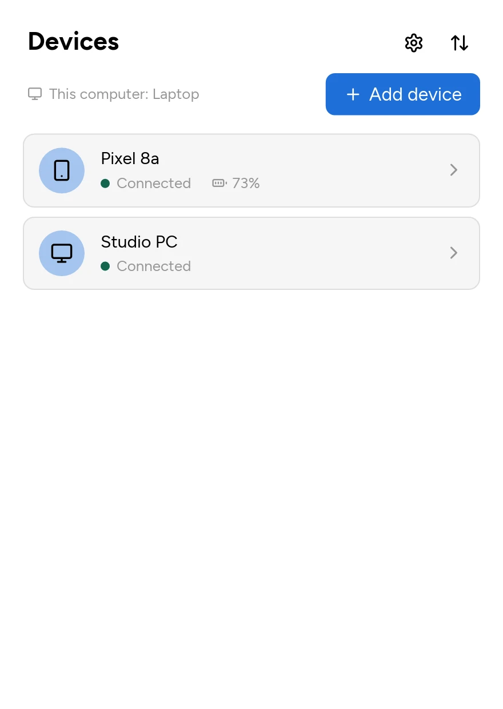
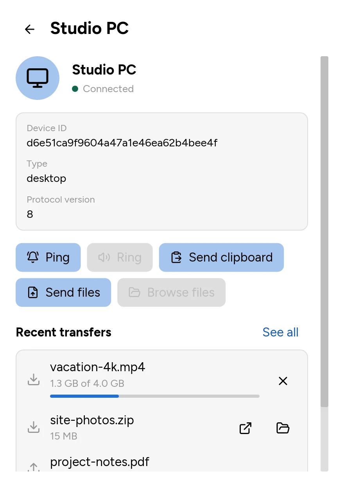
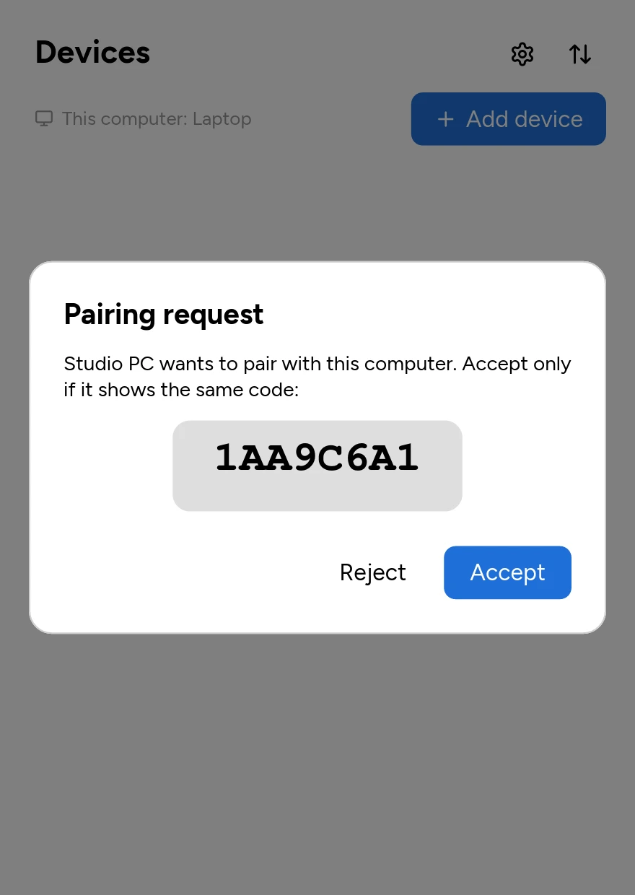
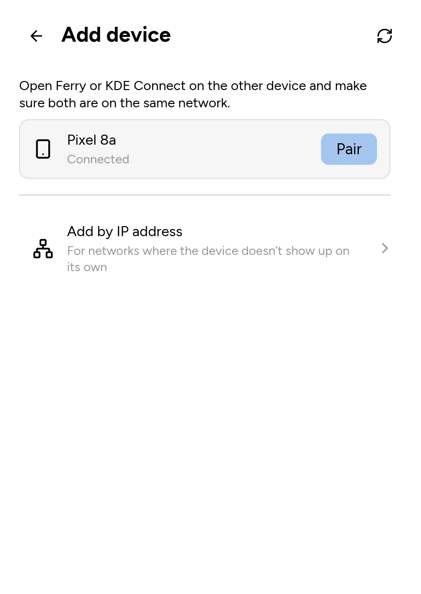
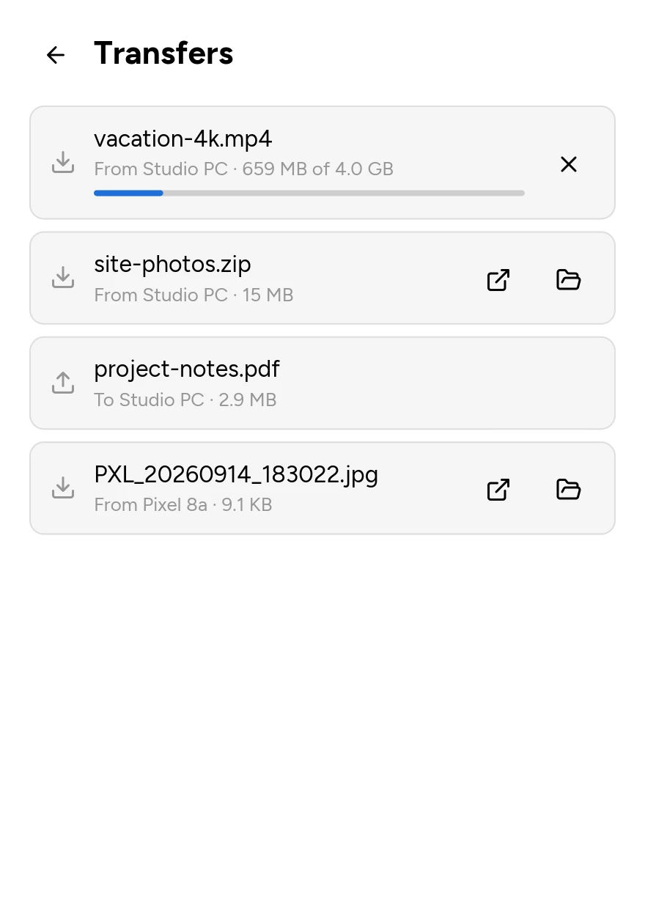
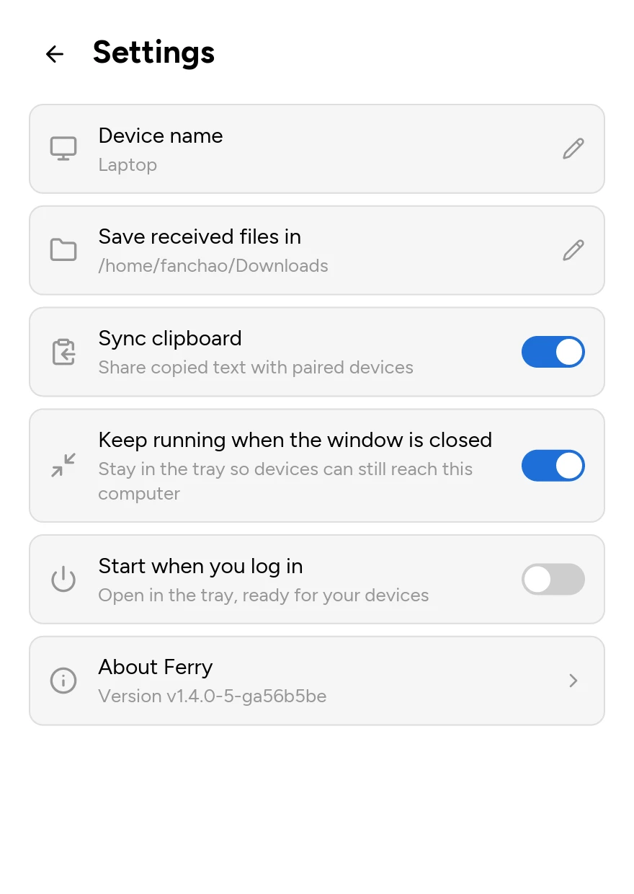
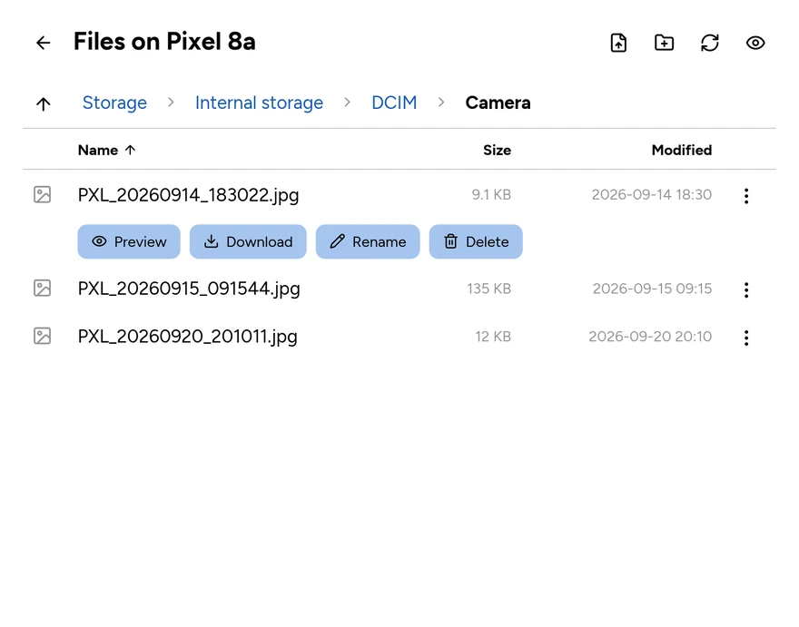
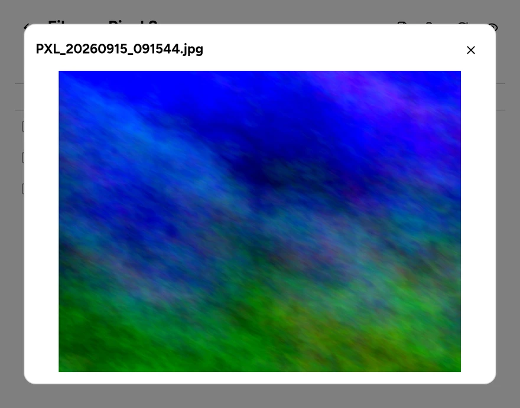

## Ferry - a KDE Connect client for macOS, Linux and Windows

Ferry is an open-source KDE Connect client in Rust: it pairs with your
phone and other devices on the local network and shares files and the
clipboard with them. It is a successor in spirit to
[Soduto](https://soduto.com), with one native desktop app for macOS, Linux
and Windows.

### Status

The MVP is implemented: LAN discovery, protocol-v8 TLS connections with
certificate pinning, user-confirmed pairing, persistent identity and trust,
text clipboard sync, file transfer with progress and cancellation, browsing
a phone's files, and a versioned local HTTP API that the CLI uses. The
desktop app (`gui/`, Rust with [iced](https://iced.rs)) runs the daemon
in-process and reads its core directly; the daemon still serves the API,
so the CLI can drive it too. It has a tray, notifications and drag and
drop, and is packaged for Linux (`.deb`, Arch), macOS (DMG) and Windows
(installer).

Pairing, clipboard sync and file transfer have been checked by hand
against KDE Connect for Android, not yet against KDE Connect on desktop.
See [`docs/ARCHITECTURE.md`](docs/ARCHITECTURE.md#11-known-gaps) for known
gaps and [`docs/HANDOFF.md`](docs/HANDOFF.md) for what to build next.

### Desktop app

The app lists your paired devices with their battery, pairs with a code
both sides confirm, sends files (from a picker, dropped on the window,
or on macOS dropped on the menu bar icon), pings and rings devices, shares
the clipboard, browses a phone's files, shows a phone's notifications
(reply, dismiss, press their buttons), and keeps running in the tray. It
follows the system's light or dark theme.

<table>
<tr>
<td valign="top"></td>
<td valign="top"></td>
<td valign="top"></td>
</tr>
<tr>
<td align="center">Paired devices</td>
<td align="center">Actions for one device</td>
<td align="center">Pairing, with a code to compare</td>
</tr>
<tr>
<td valign="top"></td>
<td valign="top"></td>
<td valign="top"></td>
</tr>
<tr>
<td align="center">Finding devices</td>
<td align="center">Transfers</td>
<td align="center">Settings</td>
</tr>
</table>

Browsing a phone's files (KDE Connect for Android shares them): download,
upload, rename, delete, create folders, and preview images.

<table>
<tr>
<td valign="top"></td>
<td valign="top"></td>
</tr>
</table>

### CLI

The CLI, `ferry-cli`, ships with the app: `/usr/bin/ferry-cli` in the
Debian package, `Ferry.app/Contents/MacOS/ferry-cli` on macOS (link it onto
your `PATH`), and next to `Ferry.exe` on Windows.

`ferry-cli run` is a daemon of its own. To drive the desktop app instead,
turn on **Settings → Command line access**: the app then serves its HTTP
API on `127.0.0.1:24816` with a token kept in its database, and
`ferry-cli` on the same computer finds both without flags. The setting
shows the address and token, with a button to copy them as environment
variables for a script run elsewhere.

#### Commands

- `ferry-cli run [--data-dir <dir>] [--download-dir <dir>] [--device-name <name>] [--discovery-loopback [--discovery-port <port>]]` -
  Run the local daemon in the foreground. `--discovery-loopback` keeps
  discovery and connections on loopback, for testing several instances on
  one machine (a switch never reflects a broadcast back to the port it came
  from, so they can't find each other over a real NIC). Discovery binds
  `127.255.255.255:1716` and the control and payload ports bind
  `127.0.0.1`, so remote devices can neither find nor connect to the
  instance. On Linux, a non-loopback Ferry or KDE Connect on the same
  machine still hears it on port 1716; `--discovery-port` moves loopback
  discovery to another port (the same for every instance that should
  meet).
- `ferry-cli devices [--watch]` - List devices and optionally follow changes.
- `ferry-cli scan [--address <ip>] [--timeout <seconds>] [--watch]` -
  Broadcast a discovery request and list unpaired devices that answer.
  `--address` announces to that IPv4 address instead, for networks where
  broadcast doesn't reach the other device.
- `ferry-cli pair <device-id>` - Start pairing with a discovered device.
- `ferry-cli pair accept|reject <pairing-id>` - Resolve a pairing request.
- `ferry-cli unpair <device-id>` - Remove trust and forget a device.
- `ferry-cli ping <device-id> [message]` - Ping a paired device, optionally
  with a message. Receiving pings is not supported yet.
- `ferry-cli ring <device-id>` - Make a paired device ring so you can find it.
- `ferry-cli send <device-id> <file> [--watch]` - Stream a file to a device.
- `ferry-cli notifications <device-id> [ls [--watch] | reply <id> <message> |
  action <id> <label> | dismiss <id>]` - List a phone's notifications, or
  answer, press a button on, or dismiss one.
- `ferry-cli clipboard get|set <text>|watch|send <device-id>` - Control text
  sync, or send the clipboard to one device now.

Add `--json` for machine-readable output. The global `--api-host`/`--api-port`
(default `127.0.0.1:24816`) set where `run` serves the control API and
where every other command connects. `--api-token` (global, or
`FERRY_API_TOKEN`; empty by default) makes `run` require that bearer token
and every other command send it; with no token the API is
unauthenticated. Prefer the environment variable, so the token doesn't
show in process listings. For development, `FERRY_API_URL` overrides the
API URL (`--api-host`/`--api-port` win when given). Given neither a token
nor an address, the other commands use the app's, read from `ferry.db` in
its data directory (`--data-dir` or `FERRY_DATA_DIR`, default the
platform's configuration directory).

### Project structure

A Cargo workspace: the main package (a shared library and a thin CLI),
plus the desktop app:

```text
src/
├── lib.rs           # shared library
├── protocol/        # wire packet models and bounded framing
├── config/          # the local identity, the API token, the app's API settings
├── store/           # the SQLite store: configs and paired devices
├── transport/       # UDP discovery, TCP/TLS, auxiliary payload connections
├── core(.rs/*)      # devices, connections, pairing, transfers, settings, events, plugin API
├── plugins/         # features: ping, findmyphone, battery, clipboard, share, browse, notifications
├── daemon(.rs/*)    # composition root: core + built-in plugins + LAN + API switch
├── api(.rs/*)       # local HTTP control plane (optional token auth)
├── client.rs        # HTTP client used by the CLI
├── ui/              # desktop UI in iced ("gui" feature)
└── bin/
    └── ferry-cli/   # CLI binary
        ├── cli.rs
        └── main.rs
gui/                 # ferry-gui: the desktop app (daemon + ui)
packaging/           # .deb, Arch PKGBUILD, macOS app, Windows installer
assets/              # icon sources and the generated icons
```

All UI code is in `src/ui/` (each feature's in
`src/ui/features/<name>.rs`), behind the `gui` cargo feature, so the CLI
and daemon build without any GUI dependency (`cargo build -p ferry`).

Run the CLI with:

```sh
cargo run -- run
cargo run -- devices
cargo run -- send <device-id> <file> --watch
```

All commands except `run` talk to the daemon through its local HTTP API.
Run the desktop app with `cargo run -p ferry-gui` (`--help` lists its
flags, which mirror `ferry-cli run`; `--demo` fills it with made-up devices).
`RUST_LOG` controls logging, e.g. `RUST_LOG=ferry=debug cargo run -- run`.

[`docs/ARCHITECTURE.md`](docs/ARCHITECTURE.md) documents the module map,
connection lifecycle, state machines and HTTP API. The original protocol
research and the plans used to build the MVP are kept in
[`docs/archive/`](docs/archive/).
### Tech stack

Ferry is async, on tokio, for many device connections, file transfers and
clipboard sync at once. Core libraries:
- `tokio` for asynchronous runtime
- `clap` for command-line argument parsing
- `serde` and `serde_json` for serialization and deserialization
- `anyhow` for error handling
- `tracing` for structured logging and diagnostics
- `thiserror` for defining custom error types
- `dotenvy` for loading environment variables from a `.env` file
