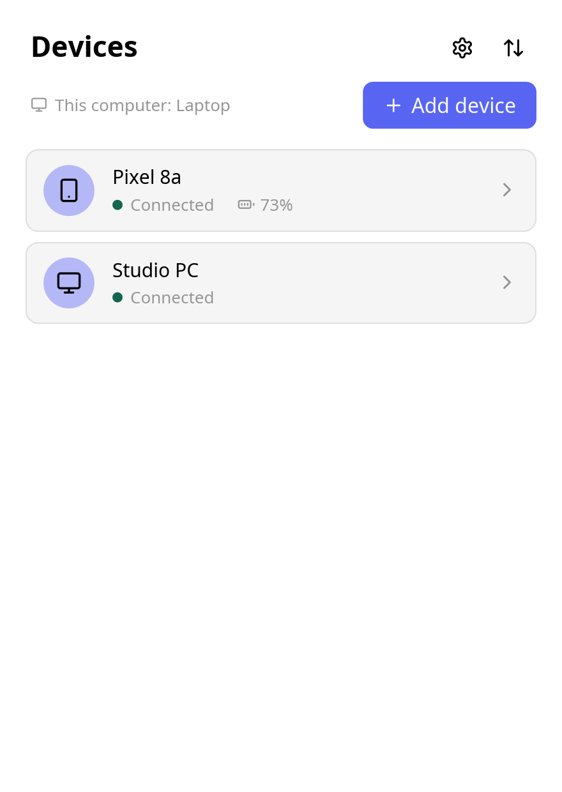
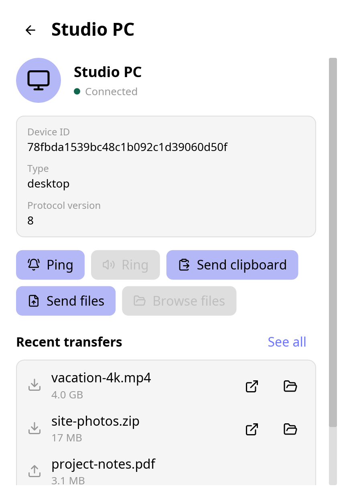
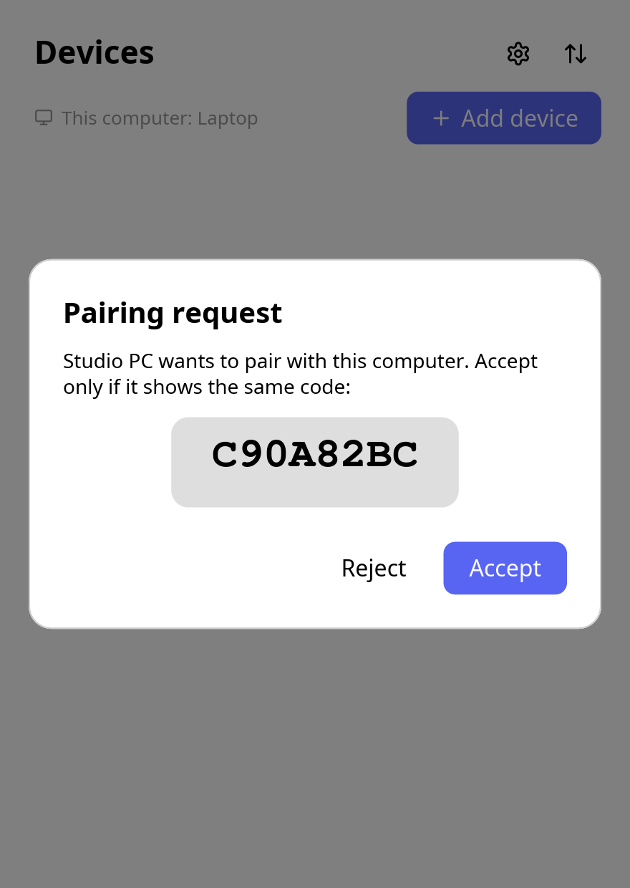
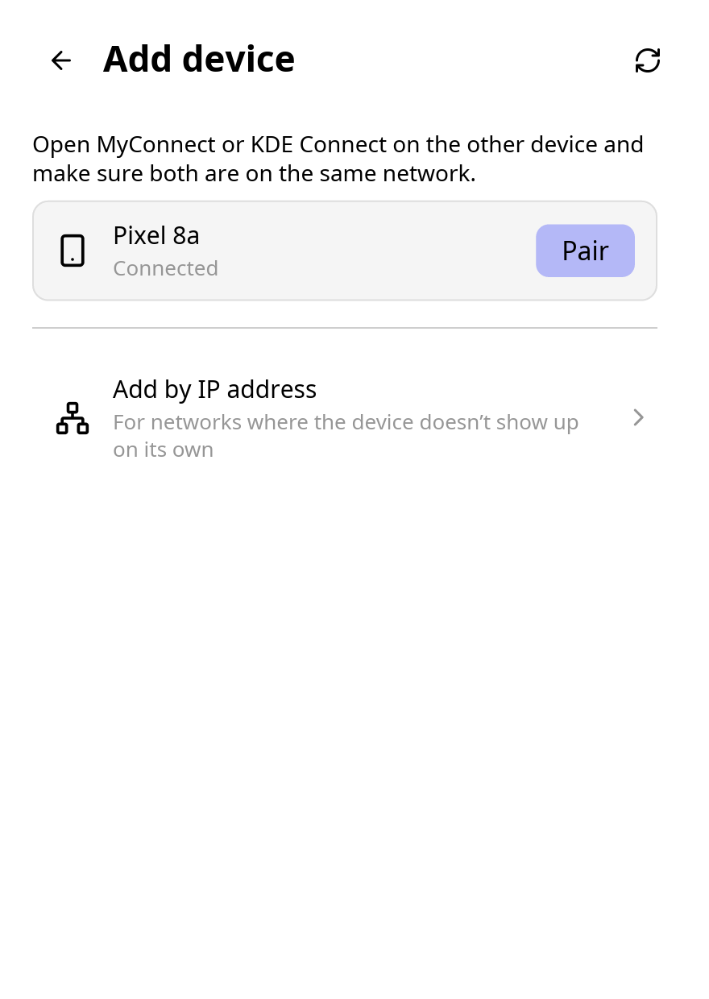
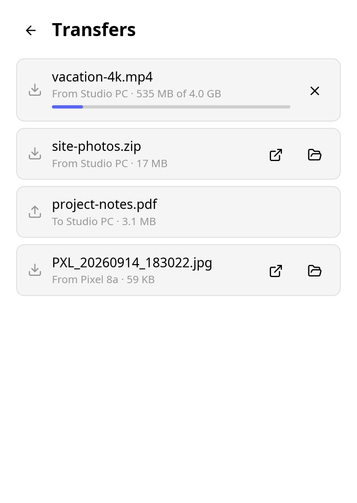
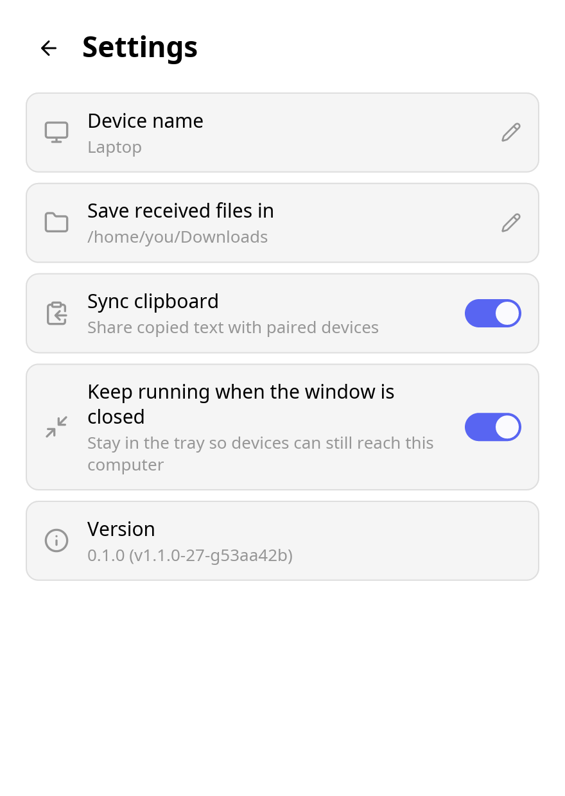
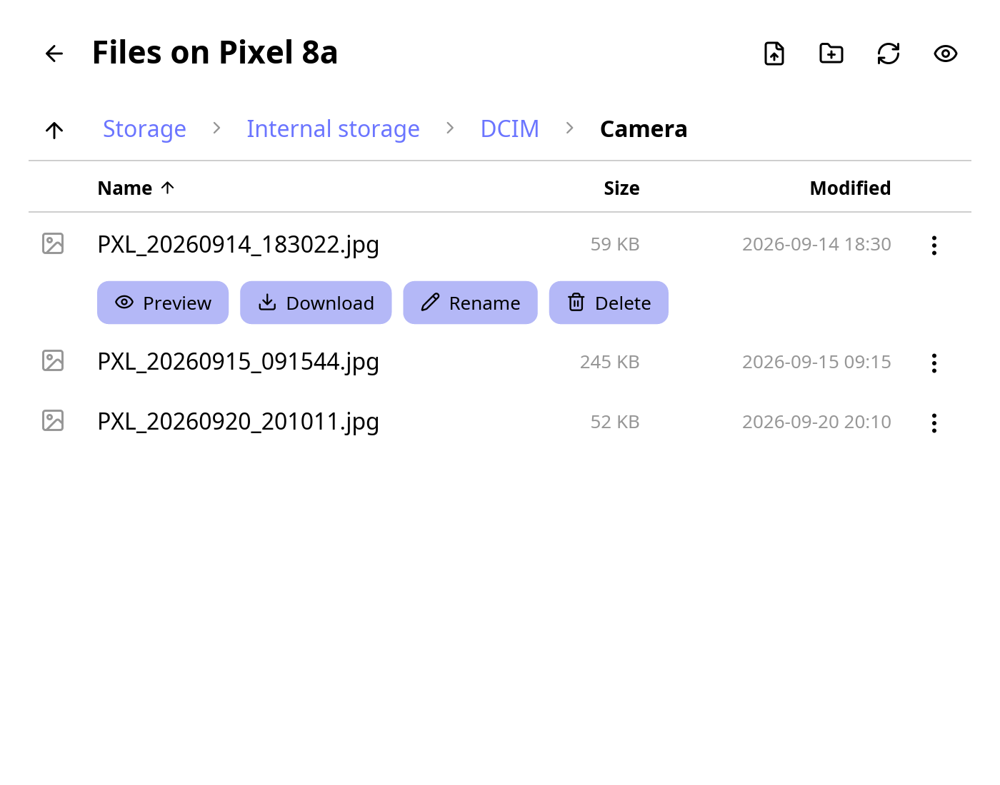
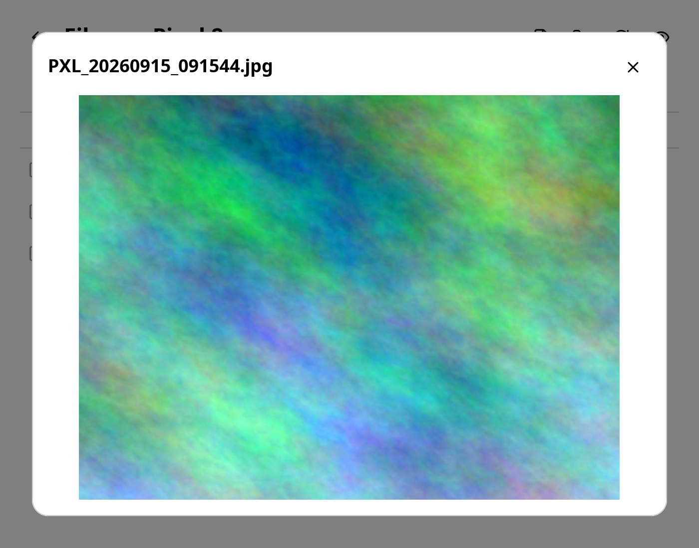

## Ferry - a KDE Connect client for macOS, Linux and Windows

Ferry is an open-source KDE Connect client written in Rust: it pairs with
your phone and other devices on the local network, and shares files and the
clipboard with them, speaking the KDE Connect protocol. It is a successor in
spirit to [Soduto](https://soduto.com), with one native desktop app for
macOS, Linux and Windows.

### Status

The MVP is implemented: LAN discovery, protocol-v8 TLS connections with
certificate pinning, user-confirmed pairing, persistent identity and trust,
text clipboard synchronization, file transfer with progress and
cancellation, browsing a phone's files, and a versioned local HTTP API that
the CLI uses. The desktop app (`gui/`, in Rust with
[iced](https://iced.rs)) runs the daemon in its own process and reads its
core directly; its daemon still serves the API, so the CLI can drive it
too. It has a tray, notifications and drag and drop, and is packaged for
Linux (`.deb`, Arch), macOS (DMG) and Windows (installer).

Pairing, clipboard sync and file transfer have been checked manually against
KDE Connect for Android, but not yet against KDE Connect on desktop; see
[`docs/ARCHITECTURE.md`](docs/ARCHITECTURE.md#10-known-gaps) for the current
list of gaps, and [`docs/HANDOFF.md`](docs/HANDOFF.md) for what to build
next.

### Desktop app

The app lists your paired devices with their battery, pairs with a code
both sides confirm, sends files (from a picker or dropped on the window),
pings and rings devices, shares the clipboard, browses a phone's files,
shows a phone's notifications (reply, dismiss, press their buttons), and
keeps running in the tray. It follows the system's light or dark
theme.

<table>
<tr>
<td valign="top"><picture><source media="(prefers-color-scheme: dark)" srcset="docs/screenshots/dark/devices.png"></picture></td>
<td valign="top"><picture><source media="(prefers-color-scheme: dark)" srcset="docs/screenshots/dark/device.png"></picture></td>
<td valign="top"><picture><source media="(prefers-color-scheme: dark)" srcset="docs/screenshots/dark/pairing-request.png"></picture></td>
</tr>
<tr>
<td align="center">Paired devices</td>
<td align="center">Actions for one device</td>
<td align="center">Pairing, with a code to compare</td>
</tr>
<tr>
<td valign="top"><picture><source media="(prefers-color-scheme: dark)" srcset="docs/screenshots/dark/add-device.png"></picture></td>
<td valign="top"><picture><source media="(prefers-color-scheme: dark)" srcset="docs/screenshots/dark/transfers.png"></picture></td>
<td valign="top"><picture><source media="(prefers-color-scheme: dark)" srcset="docs/screenshots/dark/settings.png"></picture></td>
</tr>
<tr>
<td align="center">Finding devices</td>
<td align="center">Transfers</td>
<td align="center">Settings</td>
</tr>
</table>

Browsing a phone's files (KDE Connect for Android shares them): download,
upload, rename, delete, create folders, and preview images.

<table>
<tr>
<td valign="top"><picture><source media="(prefers-color-scheme: dark)" srcset="docs/screenshots/dark/files.png"></picture></td>
<td valign="top"><picture><source media="(prefers-color-scheme: dark)" srcset="docs/screenshots/dark/file-preview.png"></picture></td>
</tr>
</table>

### CLI interface

The CLI interface is command based, allowing users to interact with Ferry through terminal commands.

#### Example Commands

- `ferry run [--data-dir <dir>] [--download-dir <dir>] [--device-name <name>] [--discovery-loopback]` -
  Run the authenticated local daemon in the foreground. `--discovery-loopback`
  keeps discovery and connections on loopback instead of the real network —
  useful for running multiple local instances against each other for testing
  (a physical switch never reflects a broadcast frame back to the port it
  came from, so two instances on one machine otherwise can't discover each
  other over a real NIC). Discovery binds `127.255.255.255:1716` and the
  control and payload ports bind `127.0.0.1`, so real devices can neither
  discover nor connect to the instance.
- `ferry devices [--watch]` - List devices and optionally follow changes.
- `ferry scan [--address <ip>] [--timeout <seconds>] [--watch]` -
  Broadcast a discovery request and list unpaired devices that answer.
  `--address` announces to that IPv4 address instead, for networks where
  broadcast doesn't reach the other device.
- `ferry pair <device-id>` - Start pairing with a discovered device.
- `ferry pair accept|reject <pairing-id>` - Resolve a pairing request.
- `ferry unpair <device-id>` - Remove trust and forget a device.
- `ferry ping <device-id> [message]` - Ping a paired device, optionally
  with a message. Receiving pings is not supported yet.
- `ferry ring <device-id>` - Make a paired device ring so you can find it.
- `ferry send <device-id> <file> [--watch]` - Stream a file to a device.
- `ferry notifications <device-id> [ls [--watch] | reply <id> <message> |
  action <id> <label> | dismiss <id>]` - List a phone's notifications, or
  answer, press a button on, or dismiss one.
- `ferry clipboard get|set <text>|watch|send <device-id>` - Control text synchronization, or send the clipboard to one device now.

Add `--json` for machine-readable output. `--api-host`/`--api-port` (global
flags, default `127.0.0.1:24816`) set the address the control API listens on
for `run` and the address every other command connects to. `--api-token`
(global, or `FERRY_API_TOKEN`; empty by default) makes `run` require that
bearer token from every API client, and makes every other command send it;
with no token the API is unauthenticated. Prefer the environment variable
over the flag so the token does not show up in process listings. For
development, `FERRY_API_URL` overrides the API URL (superseded by
`--api-host`/`--api-port` when either is given).

### Project structure

Ferry is a Cargo workspace: the main package with a shared library and a
thin CLI entry point, plus the desktop app:

```text
src/
├── lib.rs           # shared library
├── protocol/        # wire packet models and bounded framing
├── config/          # persistent identity, optional API token, peer trust
├── transport/        # UDP discovery, TCP/TLS, auxiliary payload connections
├── core(.rs/*)       # devices, connections, pairing, transfers, settings, events, plugin API
├── plugins/          # features: ping, findmyphone, battery, clipboard, share, browse, notifications
├── daemon.rs         # composition root: core + built-in plugins + LAN + API
├── api.rs               # local HTTP control plane (optional token auth)
├── client.rs             # HTTP client used by the CLI
├── ui/                   # desktop UI in iced ("gui" feature)
└── bin/
    └── ferry/            # CLI binary
        ├── cli.rs
        └── main.rs
gui/                      # ferry-gui: the desktop app (daemon + ui)
packaging/                # .deb, Arch PKGBUILD, macOS app, Windows installer
assets/                   # icon sources and the generated icons
```

All UI code lives in `src/ui/`, each feature's UI in
`src/ui/features/<name>.rs`, behind the `gui` cargo feature, so the CLI and
daemon build without any GUI dependency (`cargo build -p ferry`). See [`docs/ARCHITECTURE.md`](docs/ARCHITECTURE.md) for module
boundaries, data flow, the full HTTP API, and the pairing/transfer state
machines.

Run the CLI with:

```sh
cargo run -- run
cargo run -- devices
cargo run -- send <device-id> <file> --watch
```

Run the desktop app with `cargo run -p ferry-gui` (`--help` lists its
flags, which mirror `ferry run`; `--demo` fills it with made-up
devices).

Use `RUST_LOG` to control log output, for example
`RUST_LOG=ferry=debug cargo run -- run`.

All commands except `run` communicate with the daemon through its local HTTP
API.

The current architecture — module map, connection lifecycle, state machines,
and HTTP API reference — is documented in
[`docs/ARCHITECTURE.md`](docs/ARCHITECTURE.md). The original protocol
research and the phase-by-phase implementation plan used to build the MVP are
preserved for historical reference in [`docs/archive/`](docs/archive/).


### Tech stack and development guidelines

The app is mostly based on async/tokio, and will leverage asynchronous programming to handle multiple device connections, file transfers, and clipboard synchronization efficiently. 

Choices for basic components and libraries in the project include:
- `tokio` for asynchronous runtime
- `clap` for command-line argument parsing
- `serde` and `serde_json` for serialization and deserialization
- `anyhow` for error handling
- `tracing` for structured logging and diagnostics
- `thiserror` for defining custom error types
- `dotenvy` for loading environment variables from a `.env` file
